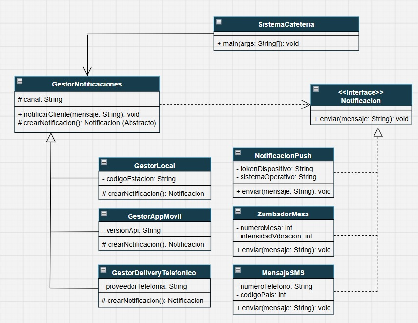

# Proyecto: EspressoEcho - Sistema de Alertas para Cafetería

Este es mi trabajo aplicando el patrón de diseño **Factory Method** para resolver el problema del envío de notificaciones en una tienda de café, dependiendo del canal de venta que use el cliente.

---

### El Problema que Elegí
Para este proyecto, imaginé el caso de una cafetería que recibe pedidos de tres formas diferentes: en la caja del local, por una app móvil y por teléfono para delivery.

El problema principal es que cuando el barista termina de preparar el café, el sistema tiene que avisarle al cliente, pero el medio cambia totalmente:
*   Si el cliente está en el local, hacemos vibrar un **Zumbador** de mesa.
*   Si pidió por la app, le tiene que llegar una **Notificación Push**.
*   Si llamó por teléfono, se le manda un **Mensaje SMS**.

Si intentaba meter toda esta lógica (y las diferentes APIs) dentro de una sola clase usando puros `if` o `switch`, iba a crear un "código espagueti" gigante. Además, si más adelante el profesor o el cliente nos pide agregar otro método (como WhatsApp), tendría que modificar el código central y correría el riesgo de romper el sistema.

---

### Por qué apliqué el patrón Factory Method
Para cumplir con los requerimientos y mantener el código limpio, decidí descentralizar la creación de los objetos usando este patrón creacional.

| Lo que aporta el patrón | Cómo me ayudó en este proyecto |
| :--- | :--- |
| **Menos acoplamiento** | El sistema de la caja registradora no interactúa directamente con las clases del zumbador o del SMS. Solo llama a un "gestor" abstracto y este se encarga de todo. |
| **Principio Open/Closed** | Si en el futuro me piden agregar alertas por correo, solo tengo que crear un par de clases nuevas. No necesito tocar el código base que ya funciona. |
| **Responsabilidad Única** | Cada clase dentro de mi carpeta `creators` tiene un solo trabajo: instanciar el tipo de notificación que le corresponde. |

---

### Mi Diagrama UML y Clases
El diagrama que armé para respaldar este código

*   **Product y Creator (Base):** `Notificacion` (la interfaz principal) y `GestorNotificaciones` (la clase abstracta que contiene el método fábrica).
*   **Concrete Products:** `ZumbadorMesa`, `NotificacionPush` y `MensajeSMS` (son las clases que tienen el código con la acción real de la alerta).
*   **Concrete Creators:** `GestorLocal`, `GestorAppMovil` y `GestorDeliveryTelefonico` (son las fábricas que deciden qué producto exacto construir).

---

### Estructura del Proyecto
Organicé el código fuente (`/src`) separando las responsabilidades en paquetes para que el repositorio quede ordenado:

*   **`base/`**: Donde están las interfaces y clases abstractas.
*   **`creators/`**: Donde están las clases que instancian las notificaciones.
*   **`products/`**: Donde programé los tipos de alertas reales.
*   **`client/`**: Aquí puse mi clase `SistemaCafeteria.java` con el `main` para hacer las pruebas.

---

### Prueba del Código (Salida en consola)
Al ejecutar el sistema cliente, el patrón Factory Method resuelve qué alerta usar dinámicamente y la consola imprime el siguiente resultado exitoso:

> **PROCESANDO ORDEN #01 [Mostrador]**
> (( ZUMBADOR VIBRANDO )) -> Su Caramel Macchiato está listo en la barra.
>
> **PROCESANDO ORDEN #02 [App Móvil]**
> [App Móvil - PUSH] -> Su Caramel Macchiato está listo en la barra.
>
> **PROCESANDO ORDEN #03 [Canal Telefónico]**
> [SMS al 555-1234] -> Su Caramel Macchiato está listo en la barra.